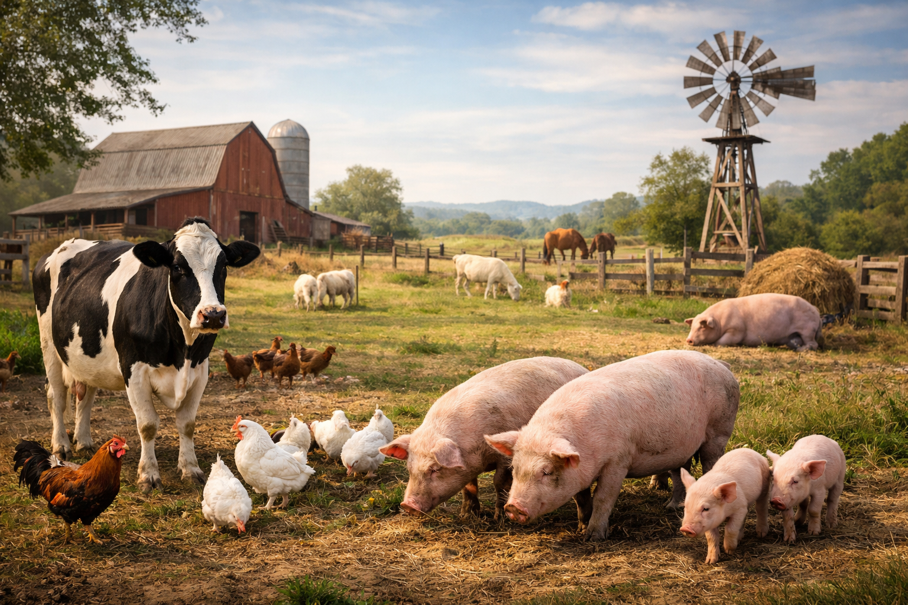

# Calculadora Ganadera

Este es mi proyecto **Calculadora Ganadera**, un sistema sencillo para registrar y calcular la producción de una granja.  
Lo desarrollé utilizando **HTML, CSS y JavaScript**.

---

## Funcionalidades

- Registro de animales y producción:
  - Vacas y litros de leche por día
  - Gallinas y huevos por día
  - Cerdos y lechones por mes
- Registro de **gastos diarios** de la granja.
- Botones para **guardar datos** y **ver resumen**.
- Interfaz con diseño moderno y responsivo.

---

## Tecnologías utilizadas

- **index.html** → estructura de la aplicación.  
- **CSS3** → estilos, colores, fondo con imagen y diseño responsivo.  
- **JavaScript** → lógica de cálculo y manejo de datos.

---

## Estructura del proyecto

Hoy

como ago para que al fondo de mi web aparezcan animales
Para que en el fondo de tu página web aparezcan animales, puedes hacerlo de varias maneras dependiendo de si quieres una imagen fija, un patrón repetido o incluso animaciones. Aquí te muestro las opciones más comunes:

🖼️ Opción 1: Imagen de fondo fija
Agrega en tu archivo CSS algo como:

css
body {
  background-image: url("animales.jpg"); /* Ruta de tu imagen */
  background-size: cover; /* Ajusta la imagen al tamaño de la pantalla */
  background-position: center; /* Centra la imagen */
  background-repeat: no-repeat; /* Evita que se repita */
}
🔄 Opción 2: Patrón repetido de animales
Si tienes una imagen pequeña (por ejemplo, un ícono de vaca o gallina), puedes hacer que se repita:

css
body {
  background-image: url("animal-icon.png");
  background-repeat: repeat; /* Se repite en todo el fondo */
}
🎬 Opción 3: Animales en movimiento (más avanzado)
Si quieres que los animales se muevan en el fondo, puedes usar GIFs o incluso animaciones con CSS/JavaScript:

css
.animal {
  position: absolute;
  width: 100px;
  animation: mover 10s linear infinite;
}

@keyframes mover {
  from { left: -100px; }
  to { left: 100%; }
}
Luego en tu HTML:

html

Esto hará que una vaca “camine” de izquierda a derecha en tu página.

👉 Pregunta clave: ¿quieres que los animales sean dibujos/íconos decorativos en el fondo, o que sean animaciones interactivas que se muevan por la pantalla?

necesito pononer o crear una carpeta que contenga una imagen
Perfecto, te explico cómo hacerlo paso a paso:

📂 1. Crear una carpeta para tus imágenes
Dentro de tu proyecto web (donde tienes tu archivo index.html), crea una carpeta llamada por ejemplo img.

Guarda dentro de esa carpeta las imágenes de animales que quieras usar, por ejemplo:

vaca.jpg

gallina.png

cerdo.jpg

Tu estructura de archivos quedaría algo así:

Código
mi-proyecto/
│
├── index.html
├── style.css
└── img/
    ├── vaca.jpg
    ├── gallina.png
    └── cerdo.jpg
🎨 2. Usar la imagen como fondo en CSS
En tu archivo style.css agrega:

css
body {
  background-image: url("img/vaca.jpg"); /* Ruta relativa */
  background-size: cover; /* Ajusta la imagen al tamaño de la pantalla */
  background-position: center;
  background-repeat: no-repeat;
}
🐔 3. Cambiar o combinar varias imágenes
Si quieres que aparezcan varios animales en el fondo, puedes:

Crear un collage en un editor de imágenes y guardarlo como una sola imagen.

O usar varias imágenes pequeñas repetidas como patrón:

css
body {
  background-image: url("img/gallina.png"), url("img/cerdo.jpg");
  background-repeat: repeat;
}
👉 Lo más sencillo es empezar con una sola imagen de fondo y luego experimentar con patrones o collages.

¿Quieres que te muestre cómo poner varias imágenes flotando en la página (como si fueran decoraciones) en lugar de un solo fondo fijo?

cmo ago pra crer la carpeta con imagenes si temgo el archivo clonado en vs code y no lo puedo hacer desde escritorio
Entiendo, si ya tienes tu proyecto clonado en VS Code y no puedes crear carpetas desde el escritorio, lo puedes hacer directamente dentro del editor. Aquí te muestro cómo:

📂 Crear carpeta en VS Code
Abre tu proyecto en VS Code.

En la barra lateral izquierda (explorador de archivos), haz clic derecho sobre la carpeta principal de tu proyecto.

Selecciona "New Folder" (Nueva carpeta).

Nómbrala por ejemplo img.

Dentro de esa carpeta, haz clic derecho y selecciona "Add File" o arrastra tus imágenes desde tu computadora hacia esa carpeta.

📥 Alternativa: Usar la terminal integrada
También puedes crear la carpeta desde la terminal de VS Code:

Abre la terminal con Ctrl + ` (la tecla de tilde invertida).

Escribe:

bash
mkdir img
Esto crea la carpeta img.

Luego copia tus imágenes dentro de esa carpeta (puedes arrastrarlas desde tu explorador de archivos hacia la carpeta en VS Code).

🎨 Usar la imagen en tu web
Una vez que tengas la carpeta con imágenes, en tu CSS puedes hacer referencia a ellas así:

css
body {
  background-image: url("img/vaca.jpg");
  background-size: cover;
  background-position: center;
}
👉 ¿Quieres que te muestre también cómo subir imágenes directamente desde VS Code sin tener que abrir el explorador de archivos externo?


asi esta bien, ya como pongo la imagen ahi dentro
¡Excelente! Ya tienes tu carpeta img creada dentro del proyecto y veo que incluso guardaste una imagen (vaca.jpg). Ahora lo que falta es mostrar esa imagen en tu página web. Tienes dos formas principales de hacerlo:

🖼️ 1. Mostrar la imagen dentro del contenido (HTML)
Si quieres que la vaca aparezca como parte del contenido de tu página, abre tu archivo index.html y agrega:

html

src="img/vaca.jpg" → le dice al navegador dónde está la imagen.

alt="Vaca en la granja" → texto alternativo por accesibilidad.

width="300" → ajusta el tamaño (puedes cambiarlo).

🎨 2. Usar la imagen como fondo (CSS)
Si lo que quieres es que la vaca aparezca en el fondo de tu página, abre tu archivo styles.css y agrega:

css
body {
  background-image: url("img/vaca.jpg");
  background-size: cover;       /* Ajusta la imagen al tamaño de la pantalla */
  background-position: center;  /* Centra la imagen */
  background-repeat: no-repeat; /* Evita que se repita */
}
🔄 3. Varias imágenes
Si más adelante agregas gallinas, cerdos, etc. en la carpeta img, puedes mostrarlas igual con etiquetas  o combinarlas en un collage para el fondo.

👉 Pregunta clave: ¿quieres que la imagen de la vaca esté como decoración de fondo de toda la página, o que aparezca dentro del formulario (por ejemplo, al lado del campo “Vacas”)?

como pongo la iamgen dentro de mi carpeta img
Muy bien, ya tienes tu carpeta img creada dentro del proyecto. Para poner una imagen ahí, lo que debes hacer es copiar o mover el archivo de imagen desde tu computadora hacia esa carpeta dentro de VS Code. Aquí te muestro cómo hacerlo:

📂 Opción 1: Arrastrar y soltar
Abre tu proyecto en VS Code.

En el explorador de archivos (barra lateral izquierda), ubica la carpeta img.

Desde tu explorador de archivos del sistema (Windows, Mac o Linux), selecciona la imagen que quieras usar.

Arrástrala y suéltala dentro de la carpeta img en VS Code.

💻 Opción 2: Crear archivo desde VS Code
Haz clic derecho sobre la carpeta img en VS Code.

Selecciona "Upload..." o "Add File" (dependiendo de tu versión).

Elige la imagen desde tu computadora y se copiará dentro de la carpeta.

🖼️ Opción 3: Usar la terminal integrada
Si prefieres hacerlo con comandos:

Abre la terminal en VS Code (Ctrl + `).

Usa el comando para mover o copiar la imagen. Por ejemplo, en Windows:

bash
copy C:\Users\TuUsuario\Pictures\vaca.jpg img\
En Linux/Mac:

bash
cp /home/usuario/Pictures/vaca.jpg img/
Una vez que la imagen esté dentro de la carpeta img, ya podrás usarla en tu HTML o CSS con la ruta relativa:

html

o como fondo:

css
body {
  background-image: url("img/vaca.jpg");
}
👉 ¿Quieres que te muestre cómo verificar desde VS Code que la imagen realmente quedó dentro de la carpeta img y se puede usar en tu página?

me puedes dar una imagen para poner de fondo


Aquí tienes una imagen lista para usar como fondo en tu proyecto.

Para aplicarla, guarda la imagen dentro de tu carpeta img y luego en tu archivo styles.css agrega este código:

css
body {
  background-image: url("img/fondo-granja.jpg"); /* Cambia el nombre según el archivo */
  background-size: cover;       /* Ajusta la imagen al tamaño de la pantalla */
  background-position: center;  /* Centra la imagen */
  background-repeat: no-repeat; /* Evita que se repita */
}
De esa forma, tu página mostrará el paisaje de granja como fondo.

👉 ¿Quieres que te muestre también cómo hacer que el fondo se vea un poco más difuminado para que el formulario destaque mejor encima?

y como guardo la imagen dentro de mi carpeta
Para guardar la imagen que quieres usar como fondo dentro de tu carpeta img, sigue estos pasos sencillos desde Visual Studio Code:

🖼️ Paso a paso para guardar la imagen
Haz clic derecho sobre la carpeta img en el explorador de archivos de VS Code.

Selecciona "Reveal in File Explorer" (o "Mostrar en el explorador" si está en español).

Se abrirá la carpeta en tu sistema operativo.

Descarga la imagen que te mostré (haz clic derecho sobre ella y selecciona "Guardar imagen como...").

Guarda la imagen dentro de la carpeta img que se abrió en el explorador.

🧾 Alternativa: arrastrar directamente
Descarga la imagen a tu escritorio o carpeta de descargas.

Luego, arrástrala directamente desde tu sistema hacia la carpeta img dentro de VS Code.

Una vez guardada, asegúrate de que el nombre del archivo sea algo como fondo-granja.jpg, y luego úsalo en tu CSS así:

css
body {
  background-image: url("img/fondo-granja.jpg");
  background-size: cover;
  background-position: center;
  background-repeat: no-repeat;
}
¿Quieres que el fondo se vea más suave o difuminado para que el formulario destaque mejor? Puedo ayudarte con eso también.


no hay ningun problema por que aperexca asi
No hay ningún problema técnico ni de funcionamiento porque la imagen aparezca con ese mensaje en Visual Studio Code. Ese error simplemente indica que VS Code no puede mostrar la imagen directamente en el editor, pero la imagen sigue estando en tu carpeta y puedes usarla en tu página web sin problema.

✅ ¿Qué significa ese mensaje?
VS Code está diseñado principalmente para editar código, no para visualizar imágenes.

A veces, al abrir una imagen en VS Code, muestra ese mensaje:
“An error occurred while loading the image”  
pero eso no afecta tu proyecto.

🧪 ¿Cómo comprobar que la imagen funciona?
Asegúrate de que la imagen esté en la carpeta img.

En tu HTML o CSS, usa la ruta correcta:

html

o

css
body {
  background-image: url("img/vaca.jpg");
}
Abre tu página en el navegador (por ejemplo, con Live Server).

Si la imagen se muestra correctamente en el navegador, ¡todo está bien!

¿Quieres que te ayude a probar otra imagen de fondo para que veas cómo se ve en tu proyecto?

aun nose como poner la foto
No te preocupes, te guío paso a paso para que pongas la foto dentro de tu carpeta img y luego la uses en tu página:

📂 1. Guardar la imagen en la carpeta img
Tienes varias formas:

Arrastrar y soltar:
Descarga la imagen que quieras usar (por ejemplo, la que te mostré antes). Luego, desde tu explorador de archivos, arrástrala directamente hacia la carpeta img en VS Code.

Copiar y pegar:
Copia la imagen desde tu carpeta de descargas o escritorio y pégala dentro de la carpeta img en tu proyecto.

Terminal en VS Code:
Si prefieres comandos, abre la terminal en VS Code (Ctrl + `) y escribe:

bash
cp /ruta/donde/esta/la/imagen/fondo-granja.jpg img/
(En Windows sería copy en lugar de cp).

🖼️ 2. Usar la imagen en tu web
Una vez que la imagen esté dentro de img, asegúrate de que el nombre sea algo sencillo, por ejemplo fondo-granja.jpg.
Después, en tu CSS agrega:

css
body {
  background-image: url("img/fondo-granja.jpg");
  background-size: cover;
  background-position: center;
  background-repeat: no-repeat;
}
🔎 3. Verificar que funciona
Abre tu página en el navegador (puedes usar la extensión Live Server en VS Code).

Si ves la foto de fondo, ¡ya quedó lista!

👉 ¿Quieres que te prepare una imagen de granja lista para descargar y poner directamente en tu carpeta img para que no tengas que buscarla tú?

que pongo en ccs
Para que tu foto aparezca como fondo en tu página, lo que debes poner en tu archivo CSS es algo así:

css
body {
  background-image: url("img/vaca.jpg"); /* aquí va el nombre de tu imagen */
  background-size: cover;       /* hace que la imagen cubra toda la pantalla */
  background-position: center;  /* centra la imagen */
  background-repeat: no-repeat; /* evita que se repita */
}
🔎 Explicación rápida
url("img/vaca.jpg") → le dice al navegador que busque la imagen dentro de la carpeta img.

background-size: cover → ajusta la imagen para que ocupe todo el fondo.

background-position: center → la centra.

background-repeat: no-repeat → evita que se repita varias veces.

👉 Si tu imagen se llama diferente (por ejemplo fondo-granja.jpg), solo cambia el nombre en la línea:

css
background-image: url("img/fondo-granja.jpg");
¿Quieres que te muestre también cómo hacer que el formulario quede con un fondo blanco semitransparente encima de la foto, para que se lea mejor?

lo pongo al final del codigo que ya tengo
Sí, puedes poner ese bloque de CSS al final del código que ya tienes en tu archivo styles.css. El orden importa solo si tienes otras reglas que también afectan al body: al estar al final, esta configuración de fondo se aplicará y “ganará” sobre cualquier otra que hayas escrito antes.

Por ejemplo, tu archivo podría terminar así:

css
/* Aquí van tus estilos anteriores */

/* Fondo de la página */
body {
  background-image: url("img/vaca.jpg"); /* cambia el nombre según tu archivo */
  background-size: cover;
  background-position: center;
  background-repeat: no-repeat;
}
🔎 Consejos
Asegúrate de que el nombre del archivo en la carpeta img sea exactamente igual al que pones en el CSS (incluyendo mayúsculas/minúsculas).

Si tu imagen se llama fondo-granja.jpg, cambia la línea a:

css
background-image: url("img/fondo-granja.jpg");
Guarda los cambios y abre tu página en el navegador (si usas Live Server, se actualizará automáticamente).

¿Quieres que te muestre también cómo hacer que el formulario tenga un fondo blanco semitransparente encima de la foto, para que se lea mejor?


como ago para que se vea un poco mejor o mas profesional el cuadro para poner la informacion
Para que tu cuadro de registro se vea más profesional y limpio, puedes mejorar el estilo con CSS. Aquí te dejo un ejemplo que puedes añadir a tu archivo styles.css:

css
form {
  background-color: rgba(255, 255, 255, 0.9); /* Fondo blanco semitransparente */
  padding: 20px;              /* Espacio interno */
  border-radius: 10px;         /* Bordes redondeados */
  box-shadow: 0 4px 10px rgba(0,0,0,0.2); /* Sombra elegante */
  max-width: 400px;            /* Ancho máximo */
  margin: 40px auto;           /* Centrado en la página */
  font-family: Arial, sans-serif; /* Fuente más moderna */
}

form h2 {
  text-align: center;
  margin-bottom: 20px;
  color: #2c3e50; /* Color del título */
}

form label {
  display: block;
  margin-top: 10px;
  font-weight: bold;
  color: #34495e;
}

form input {
  width: 100%;
  padding: 8px;
  margin-top: 5px;
  border: 1px solid #ccc;
  border-radius: 5px;
}

form button {
  width: 48%;
  padding: 10px;
  margin-top: 20px;
  border: none;
  border-radius: 5px;
  background-color: #27ae60;
  color: white;
  font-weight: bold;
  cursor: pointer;
}

form button:hover {
  background-color: #219150; /* Color más oscuro al pasar el mouse */
}
🔎 ¿Qué hace este estilo?
Fondo blanco semitransparente para que se vea bien sobre tu imagen de granja.

Bordes redondeados y sombra para dar un aspecto moderno.

Botones estilizados con color verde y efecto hover.

Fuente limpia para que el texto sea más legible.

Si aplicas esto, tu formulario se verá mucho más profesional y destacará sobre el fondo.

👉 ¿Quieres que te prepare también un estilo para que los botones tengan colores diferentes (por ejemplo, uno verde para “Guardar” y uno azul para “Ver Resumen”)?

lo pongo al final
Exacto, ese bloque de estilos lo puedes poner al final de tu archivo styles.css. De esa manera no se mezclará con reglas anteriores y se aplicará correctamente al formulario.

Tu archivo quedaría algo así:

css
/* Aquí van tus estilos anteriores */

/* Estilos para el formulario */
form {
  background-color: rgba(255, 255, 255, 0.9);
  padding: 20px;
  border-radius: 10px;
  box-shadow: 0 4px 10px rgba(0,0,0,0.2);
  max-width: 400px;
  margin: 40px auto;
  font-family: Arial, sans-serif;
}

form h2 {
  text-align: center;
  margin-bottom: 20px;
  color: #2c3e50;
}

form label {
  display: block;
  margin-top: 10px;
  font-weight: bold;
  color: #34495e;
}

form input {
  width: 100%;
  padding: 8px;
  margin-top: 5px;
  border: 1px solid #ccc;
  border-radius: 5px;
}

form button {
  width: 48%;
  padding: 10px;
  margin-top: 20px;
  border: none;
  border-radius: 5px;
  background-color: #27ae60;
  color: white;
  font-weight: bold;
  cursor: pointer;
}

form button:hover {
  background-color: #219150;
}
🔎 Recomendación
Guarda los cambios en styles.css.

Abre tu página en el navegador (si usas Live Server, se actualiza solo).

Verás tu formulario con un fondo blanco semitransparente, bordes redondeados y botones más modernos.

¿Quieres que te prepare también un estilo para que los dos botones tengan colores distintos (por ejemplo, verde para “Guardar” y azul para “Ver Resumen”)?

sigue iguañ ya te voy a mostrar todo mi codigo de css
Perfecto, muéstrame tu código de CSS completo y lo revisamos juntos. Así puedo señalar exactamente dónde agregar los estilos para tu formulario y qué ajustes hacer para que se vea más profesional.

Lo que haremos será:

Revisar si ya tienes reglas para el form, input, label o button.

Si no las tienes, te muestro cómo añadirlas al final sin que interfieran con lo demás.

Si ya existen, te enseño cómo mejorarlas (por ejemplo, con bordes redondeados, sombras, colores más modernos).

De esa forma no tendrás que adivinar dónde poner el código, sino que lo insertaremos justo en el lugar correcto.

👉 Adelante, comparte tu archivo styles.css y lo ajustamos paso a paso.

/* Reset básico */
*{
    margin:0;
    padding:0;
    box-sizing:border-box;
}

/* Fondo general */
body{
    font-family: 'Poppins', sans-serif;
    background: linear-gradient(120deg,#4CAF50,#2E7D32);
    min-height:100vh;
    display:flex;
    flex-direction:column;
    align-items:center;
    padding:40px;
    color:#333;
}

/* Título */
h1{
    color:white;
    margin-bottom:30px;
    letter-spacing:1px;
}

/* Contenedores tipo tarjeta */
.contenedor{
    background:white;
    width:380px;
    padding:25px;
    border-radius:15px;
    margin:15px;
    box-shadow:0 10px 25px rgba(0,0,0,0.2);
    transition:0.3s;
}

.contenedor:hover{
    transform:translateY(-5px);
}

/* Subtítulos */
h2{
    color:#2E7D32;
    margin-bottom:15px;
}

/* Inputs */
input{
    width:100%;
    padding:10px;
    margin:8px 0;
    border-radius:8px;
    border:1px solid #ddd;
    font-size:14px;
    transition:0.2s;
}

input:focus{
    border-color:#4CAF50;
    outline:none;
    box-shadow:0 0 6px rgba(76,175,80,0.4);
}

/* Botones */
button{
    padding:10px 18px;
    margin-top:10px;
    margin-right:8px;
    border:none;
    border-radius:8px;
    background:#4CAF50;
    color:white;
    font-size:14px;
    font-weight:500;
    cursor:pointer;
    transition:0.3s;
}

button:hover{
    background:#1B5E20;
    transform:scale(1.05);
}

/* Área del resumen */
#resultado{
    margin-top:15px;
    line-height:1.7;
    text-align:left;
}

/* Alertas */
#alertas{
    margin-top:10px;
    color:#D32F2F;
    font-weight:bold;
}

/* Responsive */
@media(max-width:500px){

.contenedor{
    width:90%;
}

}
/* Aquí van tus estilos anteriores */

/* Fondo de la página */
body {
  background-image: url("img/vaca.jpg"); /* cambia el nombre según tu archivo */
  background-size: cover;
  background-position: center;
  background-repeat: no-repeat;
}
/* Aquí van tus estilos anteriores */

/* Estilos para el formulario */
form {
  background-color: rgba(255, 255, 255, 0.9);
  padding: 20px;
  border-radius: 10px;
  box-shadow: 0 4px 10px rgba(0,0,0,0.2);
  max-width: 400px;
  margin: 40px auto;
  font-family: Arial, sans-serif;
}

form h2 {
  text-align: center;
  margin-bottom: 20px;
  color: #2c3e50;
}

form label {
  display: block;
  margin-top: 10px;
  font-weight: bold;
  color: #34495e;
}

form input {
  width: 100%;
  padding: 8px;
  margin-top: 5px;
  border: 1px solid #ccc;
  border-radius: 5px;
}

form button {
  width: 48%;
  padding: 10px;
  margin-top: 20px;
  border: none;
  border-radius: 5px;
  background-color: #27ae60;
  color: white;
  font-weight: bold;
  cursor: pointer;
}

form button:hover {
  background-color: #219150;
}
Gracias por mostrar tu código completo, ahora sí se entiende mejor lo que pasa. Tu formulario ya está dentro de un contenedor con estilos (.contenedor), y además agregaste reglas para form. Eso genera cierta redundancia: el formulario está recibiendo estilos tanto de .contenedor como de form.

🔎 Qué hacer para que se vea más profesional
Usa solo un estilo principal: ya tienes .contenedor que funciona como “tarjeta” con fondo blanco, sombra y bordes redondeados. Eso es suficiente para que el formulario se vea elegante.

Elimina o ajusta el bloque form { ... } que pusiste al final, porque está duplicando lo que ya hace .contenedor.

Mantén los estilos de inputs y botones que ya definiste: están bien logrados, con hover y sombras.

✅ Ajuste recomendado
Deja tu CSS así (simplificado):

css
/* Reset básico */
*{
    margin:0;
    padding:0;
    box-sizing:border-box;
}

/* Fondo general */
body{
    font-family: 'Poppins', sans-serif;
    background: linear-gradient(120deg,#4CAF50,#2E7D32);
    min-height:100vh;
    display:flex;
    flex-direction:column;
    align-items:center;
    padding:40px;
    color:#333;
}

/* Título */
h1{
    color:white;
    margin-bottom:30px;
    letter-spacing:1px;
}

/* Contenedores tipo tarjeta */
.contenedor{
    background:white;
    width:380px;
    padding:25px;
    border-radius:15px;
    margin:15px;
    box-shadow:0 10px 25px rgba(0,0,0,0.2);
    transition:0.3s;
}

.contenedor:hover{
    transform:translateY(-5px);
}

/* Subtítulos */
h2{
    color:#2E7D32;
    margin-bottom:15px;
}

/* Inputs */
input{
    width:100%;
    padding:10px;
    margin:8px 0;
    border-radius:8px;
    border:1px solid #ddd;
    font-size:14px;
    transition:0.2s;
}

input:focus{
    border-color:#4CAF50;
    outline:none;
    box-shadow:0 0 6px rgba(76,175,80,0.4);
}

/* Botones */
button{
    padding:10px 18px;
    margin-top:10px;
    margin-right:8px;
    border:none;
    border-radius:8px;
    background:#4CAF50;
    color:white;
    font-size:14px;
    font-weight:500;
    cursor:pointer;
    transition:0.3s;
}

button:hover{
    background:#1B5E20;
    transform:scale(1.05);
}

/* Área del resumen */
#resultado{
    margin-top:15px;
    line-height:1.7;
    text-align:left;
}

/* Alertas */
#alertas{
    margin-top:10px;
    color:#D32F2F;
    font-weight:bold;
}

/* Responsive */
@media(max-width:500px){
    .contenedor{
        width:90%;
    }
}

/* Fondo con imagen */
body {
  background-image: url("img/vaca.jpg");
  background-size: cover;
  background-position: center;
  background-repeat: no-repeat;
}
🎨 Resultado
El formulario se verá dentro de una tarjeta blanca con sombra y bordes redondeados.

Los inputs y botones tendrán un estilo moderno y consistente.

El fondo será tu imagen de granja.

👉 Si quieres que los dos botones tengan colores distintos (por ejemplo, verde para “Guardar” y azul para “Ver Resumen”), dime y te muestro cómo diferenciarlos con clases.

lo cambio todo
No necesitas cambiar todo tu CSS, lo que tienes ya está bastante bien estructurado y moderno. Lo que ocurre es que agregaste estilos para form al final, pero tu formulario ya está dentro de .contenedor, que cumple esa función de “tarjeta” con sombra y bordes redondeados.

🔎 Qué hacer
Mantén tu código actual (el que ya compartiste).

Elimina el bloque form { ... } y sus reglas que pusiste al final, porque duplican lo que ya hace .contenedor.

Deja únicamente los estilos de .contenedor, input, button, etc.

✅ Tu CSS final debería terminar así:
css
/* Responsive */
@media(max-width:500px){
    .contenedor{
        width:90%;
    }
}

/* Fondo con imagen */
body {
  background-image: url("img/vaca.jpg");
  background-size: cover;
  background-position: center;
  background-repeat: no-repeat;
}
🎨 Resultado
El formulario se verá dentro de una tarjeta blanca con sombra y bordes redondeados (gracias a .contenedor).

Los inputs y botones ya tienen estilos modernos y consistentes.

El fondo será tu imagen de granja.

👉 Si quieres que los dos botones tengan colores distintos (por ejemplo, verde para “Guardar” y azul para “Ver Resumen”), puedo mostrarte cómo diferenciarlos con clases en tu HTML y CSS. ¿Quieres que te prepare ese ejemplo?

me puedes dar el codigo completo para copiar y pegar
Perfecto, aquí tienes el código CSS completo y limpio para que lo copies y pegues directamente en tu archivo styles.css. Ya está organizado y sin duplicaciones, con el fondo de imagen y el estilo profesional para tu formulario dentro de .contenedor:

css
/* Reset básico */
*{
    margin:0;
    padding:0;
    box-sizing:border-box;
}

/* Fondo general */
body{
    font-family: 'Poppins', sans-serif;
    background: linear-gradient(120deg,#4CAF50,#2E7D32);
    min-height:100vh;
    display:flex;
    flex-direction:column;
    align-items:center;
    padding:40px;
    color:#333;
    background-image: url("img/vaca.jpg"); /* Imagen de fondo */
    background-size: cover;
    background-position: center;
    background-repeat: no-repeat;
}

/* Título */
h1{
    color:white;
    margin-bottom:30px;
    letter-spacing:1px;
}

/* Contenedores tipo tarjeta */
.contenedor{
    background:white;
    width:380px;
    padding:25px;
    border-radius:15px;
    margin:15px;
    box-shadow:0 10px 25px rgba(0,0,0,0.2);
    transition:0.3s;
}

.contenedor:hover{
    transform:translateY(-5px);
}

/* Subtítulos */
h2{
    color:#2E7D32;
    margin-bottom:15px;
}

/* Inputs */
input{
    width:100%;
    padding:10px;
    margin:8px 0;
    border-radius:8px;
    border:1px solid #ddd;
    font-size:14px;
    transition:0.2s;
}

input:focus{
    border-color:#4CAF50;
    outline:none;
    box-shadow:0 0 6px rgba(76,175,80,0.4);
}

/* Botones */
button{
    padding:10px 18px;
    margin-top:10px;
    margin-right:8px;
    border:none;
    border-radius:8px;
    background:#4CAF50;
    color:white;
    font-size:14px;
    font-weight:500;
    cursor:pointer;
    transition:0.3s;
}

button:hover{
    background:#1B5E20;
    transform:scale(1.05);
}

/* Área del resumen */
#resultado{
    margin-top:15px;
    line-height:1.7;
    text-align:left;
}

/* Alertas */
#alertas{
    margin-top:10px;
    color:#D32F2F;
    font-weight:bold;
}

/* Responsive */
@media(max-width:500px){
    .contenedor{
        width:90%;
    }
}
🎨 Resultado
El formulario se verá dentro de una tarjeta blanca con sombra y bordes redondeados.

Los inputs y botones tendrán un estilo moderno y consistente.

El fondo será tu imagen de granja (vaca.jpg).

👉 Si quieres, puedo añadir que los dos botones tengan colores distintos (verde para “Guardar” y azul para “Ver Resumen”) para que se diferencien mejor. ¿Quieres que te prepare esa versión también?

ahi esta competo y no me va a cambiar la imagen de fondo
Tu código ya está completo y bien organizado. La imagen de fondo no debería cambiarse si la tienes guardada correctamente en la carpeta img y el nombre coincide con lo que pusiste en el CSS:

css
body {
  background-image: url("img/vaca.jpg");
  background-size: cover;
  background-position: center;
  background-repeat: no-repeat;
}
🔎 Cosas que debes revisar
Nombre exacto del archivo: asegúrate de que sea vaca.jpg (con minúsculas y extensión .jpg). Si se llama Vaca.JPG o vaca.jpeg, no funcionará.

Ubicación: el archivo debe estar dentro de la carpeta img que está en tu proyecto.

Ruta relativa: como tu CSS está en la raíz del proyecto, la ruta img/vaca.jpg es correcta.

Guardar y recargar: guarda los cambios en styles.css y recarga tu página en el navegador (si usas Live Server, se actualiza solo).

👉 Si después de esto aún no ves la imagen, puede ser que el archivo esté dañado o mal copiado. En ese caso, prueba con otra imagen (por ejemplo, guarda cualquier foto en la carpeta img y cambia el nombre en el CSS).

¿Quieres que te prepare un ejemplo con otra imagen de fondo lista para probar, así confirmamos que tu CSS funciona bien?

como ago para subir estos cambios que le ise a mi git si lo tengo clonado
Como ya tienes tu proyecto clonado en tu computadora, lo que necesitas es guardar los cambios en Git y subirlos al repositorio remoto. Te dejo los pasos básicos que puedes seguir desde la terminal integrada de VS Code:

📌 Pasos para subir cambios a GitHub
Verifica el estado de tu repositorio  
En la terminal escribe:

bash
git status
Esto te mostrará qué archivos cambiaron (por ejemplo, styles.css).

Agrega los cambios al área de preparación (staging)  
Si quieres subir todos los cambios:

bash
git add .
Si solo quieres subir un archivo específico:

bash
git add styles.css
Crea un commit con un mensaje descriptivo

bash
git commit -m "Mejoré estilos del formulario y fondo"
Sube los cambios al repositorio remoto

bash
git push origin main
⚠️ Si tu rama principal se llama master en lugar de main, usa:

bash
git push origin master
🔎 Consejos
Asegúrate de estar en la carpeta del proyecto antes de ejecutar los comandos.

Si es la primera vez que haces push, Git puede pedirte autenticación (usuario/contraseña o token de GitHub).

Puedes verificar que los cambios se subieron entrando a tu repositorio en GitHub y revisando el archivo styles.css.

👉 ¿Quieres que te muestre también cómo crear una rama nueva para tus cambios (por ejemplo estilos-formulario) en lugar de subirlos directo a main? Eso es una buena práctica para mantener tu proyecto más ordenado.

con git add , git comit -m actualizacion del proyecto , git push lo puedo actualizar tambien
Exacto 👍, con esos tres comandos (git add, git commit -m "mensaje", git push) puedes actualizar tu repositorio remoto en GitHub.

El flujo sería así:

bash
git add .
git commit -m "Actualización del proyecto"
git push origin main
🔎 Detalles importantes
git add . → agrega todos los archivos modificados.

git commit -m "Actualización del proyecto" → crea un commit con tu mensaje.

git push origin main → sube los cambios a la rama main del repositorio remoto.

Si tu rama se llama master, cambia main por master.

✅ Recomendación
Antes de hacer push, puedes usar git status para confirmar qué archivos se van a subir.
Después del push, entra a tu repositorio en GitHub y verás reflejados los cambios.

👉 ¿Quieres que te muestre también cómo crear una rama nueva para tus cambios (por ejemplo estilos-formulario) en lugar de subirlos directo a main? Es una buena práctica para mantener tu proyecto más ordenado.

me puedes dar el readme
Claro, aquí tienes un ejemplo de README.md que puedes usar para tu proyecto de la calculadora/registro ganadero. Está escrito en formato Markdown para que se vea bien en GitHub:

markdown
# 🐄 Calculadora Ganadera

Este proyecto es un **Sistema de Registro de Granja** que permite llevar el control de animales y producción diaria de una granja.  
Fue desarrollado con **HTML, CSS y JavaScript**.

---

## 📋 Funcionalidades

- Registro de datos de animales:
  - Vacas y litros de leche por día
  - Gallinas y huevos por día
  - Cerdos y lechones por mes
- Cálculo de **resumen de producción**.
- Registro de **gastos diarios** de la granja.
- Interfaz amigable con diseño moderno y responsivo.

---

## 🚀 Tecnologías utilizadas

- **HTML5** para la estructura.
- **CSS3** para los estilos y diseño responsivo.
- **JavaScript** para la lógica de cálculo y manejo de datos.

---

## 📂 Estructura del proyecto

CALCULADORA-GANADERA/
│
├── img/                # Carpeta de imágenes (ej: vaca.jpg)
├── app.js              # Lógica principal en JavaScript
├── index.html          # Página principal
├── styles.css          # Estilos de la aplicación
└── README.md           # Documentación del proyecto

Código

---

## 🖥️ Uso

1. Clona el repositorio:
   ```bash
   git clone https://github.com/tuusuario/CALCULADORA-GANADERA.git
Abre el archivo index.html en tu navegador.

Ingresa los datos de tu granja en el formulario.

Haz clic en Guardar para registrar y en Ver Resumen para visualizar la producción y gastos.

📸 Captura de pantalla
(Aquí puedes añadir una imagen de tu aplicación en funcionamiento, por ejemplo la interfaz con el formulario y el fondo de granja.)

🤝 Contribuciones
Las contribuciones son bienvenidas.
Si deseas mejorar el proyecto, haz un fork, crea una rama y envía un pull request.

📜 Licencia
Este proyecto está bajo la licencia MIT.
Puedes usarlo, modificarlo y distribuirlo libremente.

Código

---

👉 Si quieres, puedo ayudarte a añadir una **captura de pantalla automática** de tu aplicación al README para que se vea más atractivo en GitHub. ¿Quieres que te muestre cómo hacerlo?
daem el reame como si lo hubiese echo yo para todo mi proyecto y los ca,bios que le iseo
Perfecto, aquí te dejo un README.md escrito como si lo hubieras hecho tú mismo, incluyendo tu proyecto completo y los cambios que le hiciste (como la mejora de estilos y el fondo con imagen):

markdown
# 🐄 Calculadora Ganadera

Este es mi proyecto **Calculadora Ganadera**, un sistema sencillo para registrar y calcular la producción de una granja.  
Lo desarrollé utilizando **HTML, CSS y JavaScript**.

---

## 📋 Funcionalidades

- Registro de animales y producción:
  - Vacas y litros de leche por día
  - Gallinas y huevos por día
  - Cerdos y lechones por mes
- Registro de **gastos diarios** de la granja.
- Botones para **guardar datos** y **ver resumen**.
- Interfaz con diseño moderno y responsivo.

---

## 🚀 Tecnologías utilizadas

- **HTML5** → estructura de la aplicación.  
- **CSS3** → estilos, colores, fondo con imagen y diseño responsivo.  
- **JavaScript** → lógica de cálculo y manejo de datos.

---

## 📂 Estructura del proyecto

CALCULADORA-GANADERA/
│
├── img/                # Carpeta de imágenes (ej: vaca.jpg)
├── app.js              # Lógica principal en JavaScript
├── index.html          # Página principal
├── styles.css          # Estilos de la aplicación
└── README.md           # Documentación del proyecto

Código

---

## 🎨 Cambios realizados

- Agregué un **fondo con imagen** (`vaca.jpg`) para darle un aspecto más realista.  
- Mejoré los **estilos del formulario** con tarjetas (`.contenedor`), sombras y bordes redondeados.  
- Personalicé los **inputs y botones** con efectos hover y colores más profesionales.  
- Hice el diseño **responsivo** para que se vea bien en pantallas pequeñas.  

---

## 🖥️ Uso

1. Clonar el repositorio:
   ```bash
   git clone https://github.com/tuusuario/CALCULADORA-GANADERA.git
Abrir el archivo index.html en el navegador.

Ingresar los datos de la granja en el formulario.

Usar los botones Guardar y Ver Resumen para visualizar la información.

📸 Captura de pantalla
(Aquí puedes añadir una imagen de tu aplicación funcionando, mostrando el formulario con el fondo de granja.)

🤝 Contribuciones
Este proyecto lo hice como práctica personal, pero cualquier mejora o sugerencia es bienvenida.
Puedes hacer un fork, crear una rama y enviar un pull request.

📜 Licencia
Proyecto bajo licencia MIT.
Libre para usar, modificar y compartir.

Código

---

👉 Este README ya refleja tu proyecto y los cambios que hiciste. Si quieres, te muestro cómo añadir una **captura de pantalla automática** al README para que se vea más atractivo en GitHub. ¿Quieres que te prepare ese ejemplo?
damelo completo para copiar pegar
Aquí tienes tu README.md completo, listo para copiar y pegar en tu proyecto. Lo escribí como si lo hubieras hecho tú mismo, incluyendo la descripción de tu proyecto y los cambios que le realizaste:

markdown
# 🐄 Calculadora Ganadera

Este es mi proyecto **Calculadora Ganadera**, un sistema sencillo para registrar y calcular la producción de una granja.  
Lo desarrollé utilizando **HTML, CSS y JavaScript**.

---

## 📋 Funcionalidades

- Registro de animales y producción:
  - Vacas y litros de leche por día
  - Gallinas y huevos por día
  - Cerdos y lechones por mes
- Registro de **gastos diarios** de la granja.
- Botones para **guardar datos** y **ver resumen**.
- Interfaz con diseño moderno y responsivo.

---

## 🚀 Tecnologías utilizadas

- **HTML5** → estructura de la aplicación.  
- **CSS3** → estilos, colores, fondo con imagen y diseño responsivo.  
- **JavaScript** → lógica de cálculo y manejo de datos.

---

## 📂 Estructura del proyecto

CALCULADORA-GANADERA/
│
├── img/                # Carpeta de imágenes (ej: vaca.jpg)
├── app.js              # Lógica principal en JavaScript
├── index.html          # Página principal
├── styles.css          # Estilos de la aplicación
└── README.md           # Documentación del proyecto

Código

---

## 🎨 Cambios realizados

- Agregué un **fondo con imagen** (`vaca.jpg`) para darle un aspecto más realista.  
- Mejoré los **estilos del formulario** con tarjetas (`.contenedor`), sombras y bordes redondeados.  
- Personalicé los **inputs y botones** con efectos hover y colores más profesionales.  
- Hice el diseño **responsivo** para que se vea bien en pantallas pequeñas.  

---

## 🖥️ Uso

1. Clonar el repositorio:
   ```bash
   git clone https://github.com/tuusuario/CALCULADORA-GANADERA.git
Abrir el archivo index.html en el navegador.

Ingresar los datos de la granja en el formulario.

Usar los botones Guardar y Ver Resumen para visualizar la información.

📸 Captura de pantalla
(Aquí puedes añadir una imagen de tu aplicación funcionando, mostrando el formulario con el fondo de granja.)

🤝 Contribuciones
Este proyecto lo hice como práctica personal, pero cualquier mejora o sugerencia es bienvenida.
Puedes hacer un fork, crear una rama y enviar un pull request.

📜 Licencia
Proyecto bajo licencia MIT.
Libre para usar, modificar y compartir.

Código

---

Con este README tu repositorio se verá mucho más profesional en GitHub.  

👉 ¿Quieres que te muestre cómo añadir una **imagen de tu aplicación** directamente en el README para que aparezca como captura de pantalla?
mira mi usuario dame todo el texto ya listo
Aquí tienes tu README.md completo, escrito como si lo hubieras hecho tú mismo y reflejando tu proyecto junto con los cambios que le realizaste. Lo puedes copiar y pegar directamente en tu repositorio:

markdown
# 🐄 Calculadora Ganadera

Este es mi proyecto **Calculadora Ganadera**, un sistema sencillo para registrar y calcular la producción de una granja.  
Lo desarrollé utilizando **HTML, CSS y JavaScript**.

---

## 📋 Funcionalidades

- Registro de animales y producción:
  - Vacas y litros de leche por día
  - Gallinas y huevos por día
  - Cerdos y lechones por mes
- Registro de **gastos diarios** de la granja.
- Botones para **guardar datos** y **ver resumen**.
- Interfaz con diseño moderno y responsivo.

---

## 🚀 Tecnologías utilizadas

- **HTML5** → estructura de la aplicación.  
- **CSS3** → estilos, colores, fondo con imagen y diseño responsivo.  
- **JavaScript** → lógica de cálculo y manejo de datos.

---

## 📂 Estructura del proyecto

CALCULADORA-GANADERA/
│
├── img/                # Carpeta de imágenes (ej: vaca.jpg)
├── app.js              # Lógica principal en JavaScript
├── index.html          # Página principal
├── styles.css          # Estilos de la aplicación
└── README.md           # Documentación del proyecto

Código

---

## 🎨 Cambios realizados

- Agregué un **fondo con imagen** (`vaca.jpg`) para darle un aspecto más realista.  
- Mejoré los **estilos del formulario** con tarjetas (`.contenedor`), sombras y bordes redondeados.  
- Personalicé los **inputs y botones** con efectos hover y colores más profesionales.  
- Hice el diseño **responsivo** para que se vea bien en pantallas pequeñas.  

---

## 🖥️ Uso

1. Clonar el repositorio:
   ```bash
   git clone https://github.com/Everaldy/CALCULADORA-GANADERA.git
Abrir el archivo index.html en el navegador.

Ingresar los datos de la granja en el formulario.

Usar los botones Guardar y Ver Resumen para visualizar la información.

📸 Captura de pantalla
(Aquí puedes añadir una imagen de tu aplicación funcionando, mostrando el formulario con el fondo de granja.)

🤝 Contribuciones
Este proyecto lo hice como práctica personal, pero cualquier mejora o sugerencia es bienvenida.
Puedes hacer un fork, crear una rama y enviar un pull request.

📜 Licencia
Proyecto bajo licencia MIT.
Libre para usar, modificar y compartir.

Código

---

Con este README tu repositorio se verá mucho más profesional en GitHub. Si quieres, te muestro cómo añadir una **imagen de tu aplicación** directamente en el README para que aparezca como captura de pantalla.
todo junto no me lo des por partes
Aquí tienes tu README.md completo y listo para copiar y pegar en tu repositorio. Está escrito como si lo hubieras hecho tú mismo, incluyendo tu proyecto y los cambios que realizaste:

markdown
# 🐄 Calculadora Ganadera

Este es mi proyecto **Calculadora Ganadera**, un sistema sencillo para registrar y calcular la producción de una granja.  
Lo desarrollé utilizando **HTML, CSS y JavaScript**.

---

## 📋 Funcionalidades

- Registro de animales y producción:
  - Vacas y litros de leche por día
  - Gallinas y huevos por día
  - Cerdos y lechones por mes
- Registro de **gastos diarios** de la granja.
- Botones para **guardar datos** y **ver resumen**.
- Interfaz con diseño moderno y responsivo.

---

## 🚀 Tecnologías utilizadas

- **HTML5** → estructura de la aplicación.  
- **CSS3** → estilos, colores, fondo con imagen y diseño responsivo.  
- **JavaScript** → lógica de cálculo y manejo de datos.

---

## 📂 Estructura del proyecto

CALCULADORA-GANADERA/
│
├── img/                # Carpeta de imágenes (ej: vaca.jpg)
├── app.js              # Lógica principal en JavaScript
├── index.html          # Página principal
├── styles.css          # Estilos de la aplicación
└── README.md           # Documentación del proyecto

---

## Cambios realizados

- Agregué un **fondo con imagen** (`vaca.jpg`) para darle un aspecto más realista.  
- Mejoré los **estilos del formulario** con tarjetas (`.contenedor`), sombras y bordes redondeados.  
- Personalicé los **inputs y botones** con efectos hover y colores más profesionales.  
- Hice el diseño **responsivo** para que se vea bien en pantallas pequeñas.  

---

##  Uso

1. Clonar el repositorio:
   ```bash
   git clone https://github.com/Everaldy/CALCULADORA-GANADERA.git
 
 ## autores
 everaldy ayala y alejandra valencia 